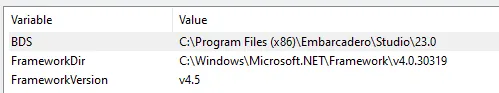
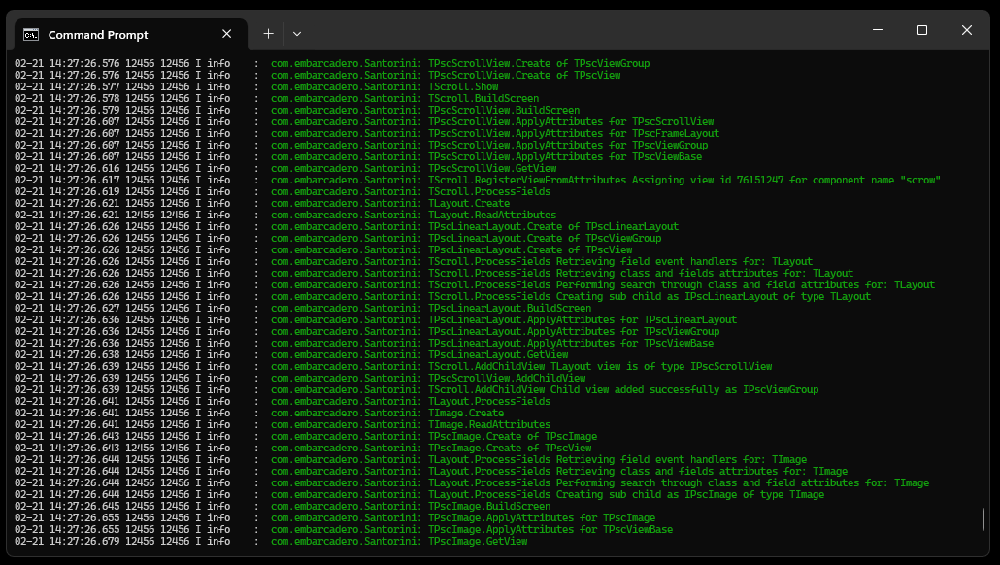
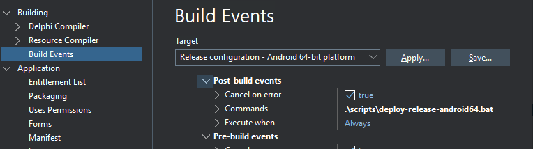

## What is this?
This is a simplified wrapper for Android's native Widgets JNI. There are multiple approaches to building Android UIs in Delphi - this represents one alternative path that bypasses FMX overhead by accessing the native layer directly. It's worth noting this is probably not the best solution for every use case.

The library provides rapid access to Android's native UI layer through JNI bindings available in the RTL source. It was developed as a proof-of-concept to explore alternatives for implementing Android Views. This is an experimental work in the study phase, so it comes with limitations and bugs. Only a subset of the most essential widget functions are currently implemented, as covering the entire Android widget API would be a time consuming task. 


## Widgets JNI Inheritance
JView is the base class for all the widgets within groups (I),  and (II). The following table shows the inheritance hierarchy of the interfaces. I tried to keep this inheritance hierarchy when implementing the wrappers and if you notice under <code>Pisces.View</code> and <code>Pisces.ViewGroup</code>, you'll see that the ```IPsc``` interfaces and ```TPsc``` classes are arranged in the same order as this diagram. This would save me from having to re-write existing methods twice (or three times, or four times) because of inheritance. They are classified this way:

- ❌ - Not implemented
- 🫠 - Under development
- 👈 - Exported but partially implemented
- 🫥 - Not exported / Used internally

```

Group (I)
JObjectClass
├── JBaseAdapterClass
│   └── JBaseAdapter ❌
├── JPopupWindowClass
│   └── JPopupWindow 👈
├── JScrollerClass
│   └── JScroller 👈
└── JToastClass
    └── JToast 👈

Group (II)
JEnumClass
└── JTextView_BufferTypeClass
    └── JTextView_BufferType ❌

Group (III)
JViewClass
├── JTextViewClass
│   ├── JButtonClass
│   │   ├── JCompoundButtonClass
│   │   │   └── JCompoundButton
|   |   |       └── JSwitch 👈
│   │   └── JButton 👈
│   └── JEditTextClass
│       └── JEditText 👈
└── JImageViewClass
    └── JImageView 👈

Group (IV)
JViewGroupClass
├── JAdapterViewClass
│   ├── JAbsListViewClass
│   │   ├── JListViewClass
│   │   │   └── JListView 🫠 
│   │   └── JAbsListView ❌
│   └── JAdapterView ❌
├── JAbsoluteLayoutClass
│   └── JAbsoluteLayout 👈 
├── JFrameLayoutClass
│   ├── JCalendarViewClass
│   │   └── JCalendarView 👈
│   ├── JDatePickerClass
│   │   └── JDatePicker 👈
│   ├── JScrollViewClass
│   │   └── JScrollView 👈
│   ├── JTimePickerClass
│   │   └── JTimePicker 👈
│   └── JFrameLayout 👈
├── JLinearLayoutClass
│   └── JLinearLayout 👈
├── JRelativeLayoutClass
│   └── JRelativeLayout 👈
└── JToolbarClass
    └── JToolbar 👈

Group (V)
JViewGroup_LayoutParamsClass
├── JAbsListView_LayoutParamsClass
│   └── JAbsListView_LayoutParams 🫥 
└── JFrameLayout_LayoutParamsClass
    ├── JLinearLayout_LayoutParamsClass
    │   └── JLinearLayout_LayoutParams 🫥 
    └── JRelativeLayout_LayoutParamsClass
        └── JRelativeLayout_LayoutParams 🫥 

```
Embarcadero did a great job of providing many JNIs for Android 14 (version 34 SDK level API ) and their number is extensive. It would be a tedious task to have implemented a wrapper for them all, so what I did was just to take the basic JNIs for creating Views - and even that was not entirely covered because some methods are used for internal purposes and motion logic, not relevant for styling and layout. This doesn't mean they are inaccessible, because I'm still exporting the JView under TPisces properties, plus forwarding the JNI types in ```Pisces.Types```. So it’s still possible to access all JNI methods, except that some methods are not exposed via attributes, only those relevant to customization of the view.  

## Understanding the Bauble
Everything starts with two things: the attributes and the TPisces class. To create a view, you would need to write something like this:

```pascal

uses
  Pisces;

type
  [View('myviewname')]
  TMyView = class(TPisces)

  end;

var
  MyView: TMyView;

initialization
  MyView := TMyView.Create;
  MyView.Show;

finalization
  MyView.Free;

```

What does this do? It's creating a class derived from TPisces and, based on the attributes provided, it creates a corresponding view with the name "myviewname". The class is registered under <code>Pisces.Registry</code>, which keeps track of all views created assigning them an ID in a dictionary of JViews. The class is created and the view is placed in the Android activity (method Show). The view is a native Android view, so it can be styled and manipulated as any other native Android view using the attributes exposed in <code>Pisces.pas</code>. We can customize the view by setting other attributes in this way:

```pascal

uses
  Pisces;

type
  [View('myviewname')]
  [BackgroundColor(143, 223, 181)]
  [Padding(20, 20, 20, 20)]
  [RippleColor(213, 121, 26)]
  [CornerRadius(100)]
  [Height(1000)]
  TMyView = class(TPisces)

  end;

```
The attributes to _**build**_ views are:

```pascal
  unit Pisces.Attributes;

  ViewAttribute = Pisces.Attributes.ViewAttribute;
  TextViewAttribute = Pisces.Attributes.TextViewAttribute;
  ButtonAttribute = Pisces.Attributes.ButtonAttribute;
  SwitchButtonAttribute = Pisces.Attributes.SwitchButtonAttribute;
  EditAttribute = Pisces.Attributes.EditAttribute;
  ImageViewAttribute = Pisces.Attributes.ImageViewAttribute;
  ViewGroupAttribute = Pisces.Attributes.ViewGroupAttribute;
  LinearLayoutAttribute = Pisces.Attributes.LinearLayoutAttribute;
  RelativeLayoutAttribute = Pisces.Attributes.RelativelayoutAttribute;
  ToolBarAttribute = Pisces.Attributes.ToolBarAttribute;
  FrameLayoutAttribute = Pisces.Attributes.FrameLayoutAttribute;
  ScrollViewAttribute = Pisces.Attributes.ScrollViewAttribute;
  AbsoluteLayoutAttribute = Pisces.Attributes.AbsoluteLayoutAttribute;
  TimePickerAttribute = Pisces.Attributes.TimePickerAttribute;
  DatePickerAttribute = Pisces.Attributes.DatePickerAttribute;
  CalendarAttribute = Pisces.Attributes.CalendarAttribute;
  ListViewAttribute = Pisces.Attributes.ListViewAttribute;
````
All other attributes are used to style the views. Not all attributes are supported for all views, check the comments in the source code; I’ve added notes there to indicate which attributes are supported for each view. For example, you cannot use the Orientation attribute for a ```TextView``` due to inheritance — and because it simply doesn’t make sense - but orientation is required when you have a ```LinearLayout```. 

Now, with these basics, we could try something more 'standard' for the Android world, that is to make use of layouts to organize the views, then assign other views inside the layout, with buttons, images, etc. Finally we could nest them inside a Scrollview if the screen space is not enough. We could declare them as fields in the main class representing the screen. 

```pascal


  [LinearLayout('MyCard')]
  [BackgroundColor(243, 123, 231)]
  [Padding(20, 20, 20, 20)]
  [Height(1500)]
  TMyCard = class(TPisces)

  end;

  [Button('MyButton')]
  [TextSize(20)]
  [TextColor(255, 255, 255)]
  [BackgroundTintList(119, 156, 205)]
  [Height(300)]
  [Text('Click me!')]
  TMyButton = class(TPisces)
  public
    procedure OnClick(View: JView);
  end;

  [LinearLayout('MyLayout')]
  [Orientation(TOrientation.Vertical)]
  [Clickable(True)]
  [Height(7000), BackgroundColor(10, 240, 120)]
  TMyLayout = class(TPisces)
    FCard: TMyCard;
    FButton: TMyButton;
  end;

  [ScrollView('MyScrollView')]
  TMyScrollView = class(TPisces)
  private
    FLayout: TMyLayout;
  end;

  [ViewGroup('MyScreen')]
  [FullScreen(True)]
  [DarkStatusBarIcons(True)]
  TMyScreen = class(TPisces)
  private
    FScrowView: TMyScrollView;
  end;

initialization
  Screen := TScreen.Create;
  Screen.Show;

finalization
  Screen.Free;

```

You simply need to declare the view as a field in the screen class. Then, create and show. The views are automatically instantiated and added to the view by RTTI. They are also automatically destroyed when you free the parent class, because each TPisces instance holds a dictionary of children instances. I'm not sure if this is the best approach, but it works. I think there is a better way by using visual design time components, and making them bypassing  FMX, but I'm not the best guy to do this, it's outside the scope of my knowledge.

## Debugging 

I don't use Embarcadero PAServer to Debug. I use stone and chisels, which is a great tool to debug Android apps. You can take a look how it works [here](https://samuel-ro.medium.com/android-deploy-script-in-delphi-9abbd461fafc). 

You need to have:
```
1. Android Studio (even if you do not use an emulator).
2. Microsoft Net Framework v4.5.
```

Add the following to system path:

```shell
C:\Users\<your_user>\AppData\Local\Android\Sdk\emulator
C:\Users\<your_user>\AppData\Local\Android\Sdk\platform-tools
C:\Windows\Microsoft.NET\Framework\v4.0.30319
```

Add these variables to your user or system environment variables:

```shell
BDS = “C:\Program Files (x86)\Embarcadero\Studio\23.0”
FrameworkDir = “C:\Windows\Microsoft.NET\Framework\v4.0.30319”.
FrameworkVersion = “v4.5”.
```


Logs are sent using <code>Pisces.Utils</code> and if your terminal supports ASCII escape sequences, you can see them colored displayed like this :


But you will only see it if you fetch them from logcat, filtering by your app's package name.

```shell
  adb devices
  adb -s <emulator-name> logcat | grep -e "com.embarcadero"
```

## Build and Deploy  
Since I'm skipping PAServer, I may have two alternatives to perform the deployment thus avoiding the "F9 magic trap". Deploying the app in the emulator or physical device with the F9 key forces a bunch of junk/unnecessary files to be delivered with it, which can bloat the APK and consume device storage..  

### Alternative (I) - Script 
Create this script and add it to your project's folder:

```bat
msbuild YourProject.dproj /p:Config=Release /target:Deploy /p:platform=Android64

REM Retrieve the first emulator from adb devices list
for /f "tokens=1" %%i in ('adb devices ^| findstr /i "emulator"') do set emulator=%%i

REM Check if an emulator was found, if not, prompt the user
if "%emulator%"=="" (
    echo No emulator found! Please start an emulator.
    pause
    exit /b
)

REM Clear the app data (if installed already)
adb -s %emulator% shell pm clear com.embarcadero.YourProject

REM Install the APK on the selected emulator
adb -s %emulator% install -r .\bin\Android64\Release\YourProject\bin\YourProject.apk

REM Start the app on the emulator
adb -s %emulator% shell am start -n com.embarcadero.YourProject/com.embarcadero.firemonkey.FMXNativeActivity

```

Inform the path of this script under Build Events > Commands in Delphi.


### Alternative (II) - 👾apkmon 
Use my [apkmon](https://github.com/p-samuel/apkmon) tool, which deploys the APK automatically as soon as it detects changes in the .so shared libraries, given you inform the projects names and locations. 


## Notes

I wish I could have provided other examples that were in my list but due to the time consuming nature of other projects I had to work on, these were skipped at first place. It's my plan to update this repository with more examples along time. Take my notes as an advice before studying this:
```
There are several ways to do one thing, this is just another and certainly not the best one
```